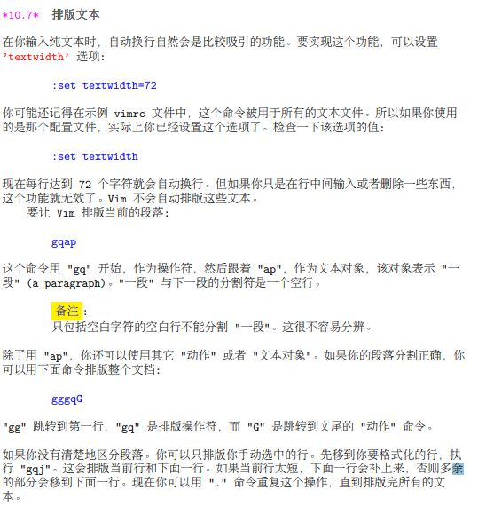
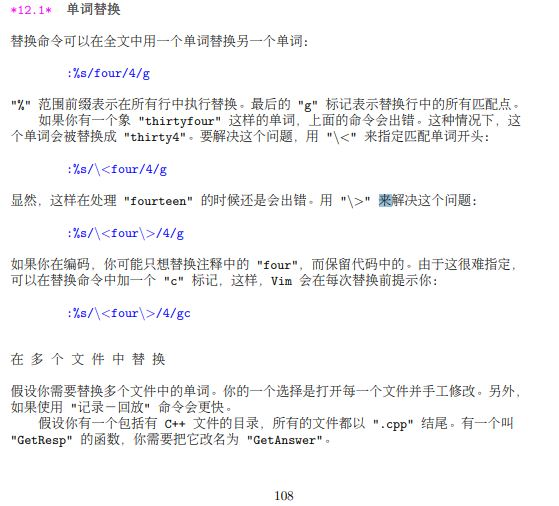
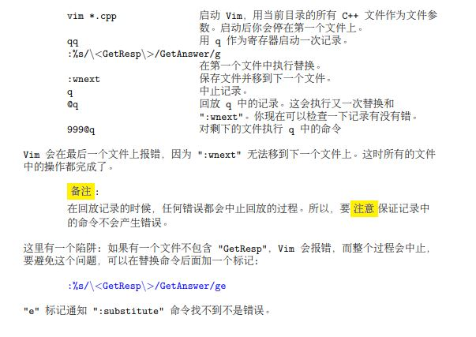
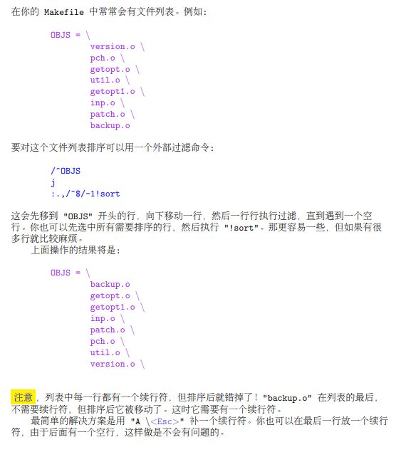
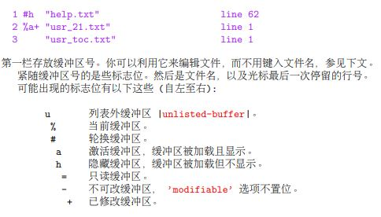
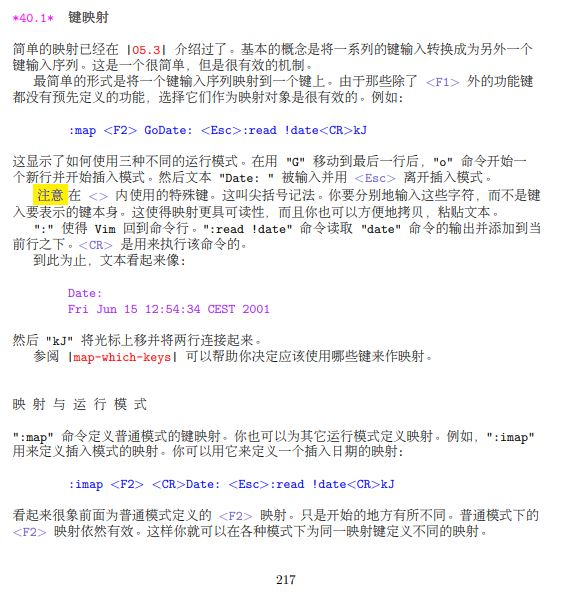
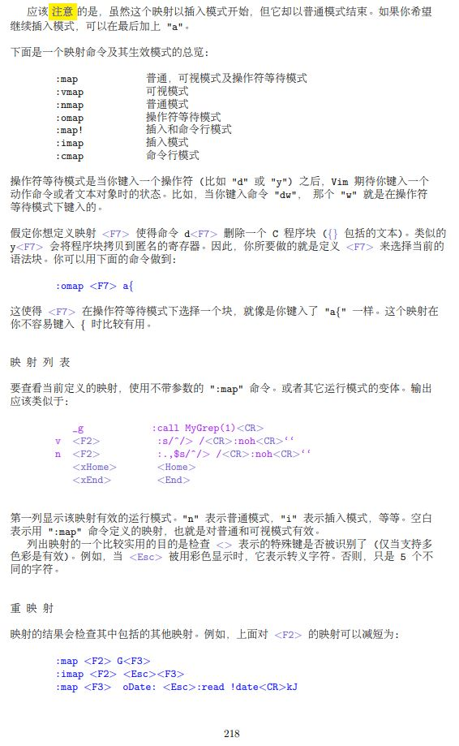
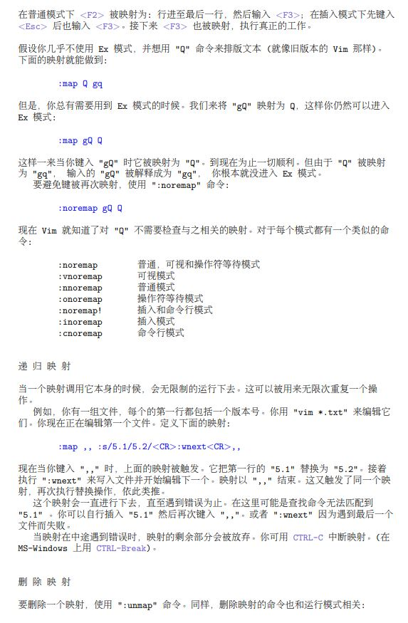
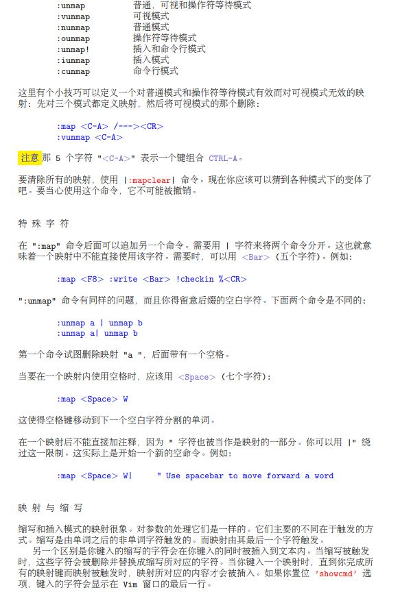
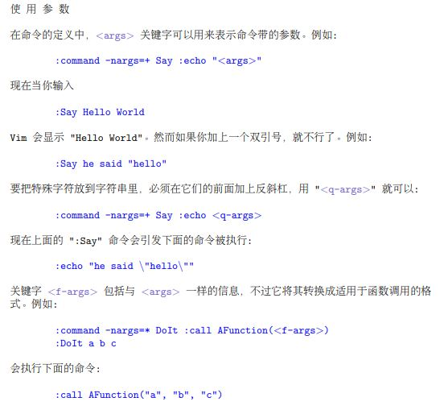

# vim 教程

# 1. 移动

## 1.1 词移动

- **w**向前到词首，**3w** 向前 3 个
- **b** 向后到词首，**3b**
- **e** 向后到词末，**3e**，**ge** 反向

## 1.2 移动到行首或行尾

- **\$** 移动到行尾，**^** 移动到第一个非空字符，**0** 移动到行首；**2\$** 移动到下一行行尾

## 1.3 移动到指定字符

- **f** 代表查找，**fh** 代表查找行内 **h**, **3fh**，执行 3 次；**F** 反向查找，类似命令 **t**，光标移动到目标字符前一个字符；反向 **T**

## 1.4 括号匹配 (),[],{}

- **%** 匹配括号(),[],{}

## 1.5 移动到指定行

- **gg** 到第一行
- **G** 到最后一行
- **32G** 到 32 行
- **50%** 文件中间
- **H** 视野内第一行
- **M** 视野内中间
- **L** 视野内末尾

## 1.6 确定当前位置

- **CTRL-G**
- **:set number** 显示行号，**:set nonumber** 不显示行号
- **set ruller** 右下位置提示框

## 1.7 滚屏

- **CTRL-U** 上滚半屏
- **CTRL-D** 下滚半屏
- **CTRL-E** 上滚一行
- **CTRL-Y** 下滚一行
- **CTRL-F** 前滚一屏
- **CTRL-B** 后滚一屏
- **zz** 光标到屏幕中间
- **zt** 光标到屏幕顶部
- **zb** 光标到屏幕底部

## 1.8 简单查找

- **/String** 查找 String，**?String** 反向查找 String，查找成功后，**n** 匹配下一个，**N** 反向匹配下一个
- **/the\\>**，**\\>** 代表只匹配单词末尾，**\\<**只匹配开头，**/\\\<the\\>** 只匹配 the
- **\*** 向下查找当前光标所在单词，**3\*** 查找第三次出现的地方，**\#** 反向查找，这两个命令使用了词首加词尾限制，要部分匹配使用 **g\*** 和 **g\#**

## 1.9 查找模式

- **/**, **?** 支持正则表达式匹配查找

## 1.10 标记

- **ma** 标记当前光标位置(可标记 a-z)共 26 个，然后使用 **'a** 进行跳转
- **''** 返回跳转前的位置位置，不包括 **k** 、 **j** 跳转

- **CTRL-O** 跳到较老地方，**CTRL-I** 跳到较新地方
- **:jumps** 可以输出一个你可以跳往的位置列表
- 特殊标记

1. **`** 跳转前光标位置
2. **''** 最后编辑的光标位置
3. **[** 最后修改的开始位置
4. **]** 最后修改的结束位置

# 2. 小改动

## 2.1 操作符与动作

- **dw** 删除一个单词，**d4w** 删除 4 个词，**dd** 删除当前行， **d\$** 删到行尾，**d** 命令可与任意光标移动命令组合

## 2.2 修改文本

- **c** ， 修改，与 **d** 类似， **c2wbe** 删除两个单词然后插入 be
- **cc** 修改一行
- **c\$** 修改到末尾
- 快捷键

1. **x** 表示 **dl** (删除光标下字符)
1. **X** 表示 **dh** (删除光标左边字符)
1. **D** 表示 **d\$** (删除到行尾)
1. **C** 表示 **c\$** (修改到行尾)
1. **s** 表示 **cl** (修改一个字符)
1. **S** 表示 **cc** (修改一整行)

- **r** 替换单个字符， **5rw** 替换 5 个字符为 w

## 2.3 重复一个修改

- **.** 重复最后一次除 **u** ， **CTRL-R** 和冒号命令外的修改操作

## 2.4 可视模式

- **v** 启动选择模式
- **V** 启动行选择模式
- **CTRL-V** 启动块选择模式
- **o** 选择模式下光标移动到文字另一端，块选择模式下移动到对角

## 2.5 移动文本

- **d** 、 **x** 命令会将修改的内容复制到粘贴板，然后使用 **p** 粘贴

## 2.6 拷贝文本

- **y** 拷贝到寄存器， **yy** 拷贝一行， **yw** 拷贝包含空格的单词， **ye** 拷贝不包含空格的单词

## 2.7 文本对象

- **daw** 删除一个词，其中 aw 是一个文本对象
- **cis** 改变一个句子， **cas** 改变一个句子，区别是 as 包含句子后面的空白字符

---

---

---

---

## 2.8 替换模式

- **R** 启动替换模式

## 2.9 总结

- 操作符、移动命令和文本对象可以有各种组合，用 N 个操作符加上 M 个移动命令，组合出 N\*M 个命令
- **X** 删除光标前的字符 ("dh" 的缩写)
- **D** 从当前位置删除到行尾 ("d\$" 的缩写)
- **dw** 从当前位置删除到下一个单词开头
- **db** 从当前位置删除到前一个单词的开头
- **diw** 删除光标上的单词 (不包括空白字符)
- **daw** 删除光标上的单词 (包括空白字符)
- **dG** 删除到文件末
- **dgg** 删除到文件首

# 3. 编辑多个文件

## 3.1 编辑另一个文件

- **:edit foo.txt** 编辑 foo.txt

## 3.2 文件列表

- **vim one.c two.c three.c** ，vim 只显示第一个。
- **:next** 下一个， **:2next** 下两个
- **:args** 查看整个文件列表
- **:previous** 回到前一个
- **:last** 最后一个
- **:first** 第一个
- **:set autowrite** 自动保存
- **:set noautowrite** 关闭自动保存
- **args five.c six.c** 编辑另一个文件列表

## 3.3 从一个文件跳到另一个文件

- **CTRL-^** 两个文件间快速跳转
- 预定义标记

1. **'"** 跳转到上次离开这个文件时位置
2. **'.** 跳转到最后一次修改文件时位置

- 文件标记

1. **m** m[a-z]标记只在一个文件内有效，m[A-Z]在任何文件中都有效
2. **:marks MCP** 查看 M、C、P 标记在什么地方

## 3.4 备份文件

- **:set backup** 产生备份文件

## 3.5 文件间拷贝文本

- 使用寄存器(a-z)

1. **"fyas** 将一个句子拷贝到 f 寄存器

- 添加到文件

1. **:write >> logfile** 将文本写入到文件末尾

## 3.6 显示文件

- **vim -R file** 只读模式打开 file，可强制写入
- **vim -M file** 只读模式打开，不可强制写入
- **:set modifiable** 去除-M 只读模式
- **:set write** 去除-R 只读模式

## 3.7 修改文件名

- **:saveas file** 保存为新命名文件
- **:file file** 标记为新命名文件，不立即保存

# 4. 分割窗口

## 4.1 分割窗口

- **:split** 分为上下两个窗口
- **CTRL-W w** 、 **CTRL-W CTRL-W** 窗口间跳转
- **:close** 关闭窗口
- **:quit** 也可以关闭窗口
- **ZZ** 也可以关闭窗口
- **:only** 关闭其他所有窗口

## 4.2 用另一个文件分割窗口

- **:split** 、 **:split file** 用另一个文件填充新窗口
- **:new** 打开新窗口

## 4.3 窗口大小

- **:3split file** 三行窗口打开新文件

## 4.4 垂直分割

- **vsplit** 、 **vsplit file** 左右分割窗口
- **vew** 打开一个垂直分割的新窗口
- **vertical new** vertical 前缀，垂直方式新建窗口
- 窗口间跳转

1. **CTRL-W h** 跳转到左边的窗口
2. **CTRL-W j** 跳转到下面的窗口
3. **CTRL-W k** 跳转到上面的窗口
4. **CTRL-W l** 跳转到右边的窗口
5. **CTRL-W t** 跳转到最顶上的窗口
6. **CTRL-W b** 跳转到最底下的窗口

## 4.5 移动窗口

- **CTRL-W K** 把当前窗口移到最上边
- **CTRL-W H** 把当前窗口移到最左边
- **CTRL-W J** 把当前窗口移到最下边
- **CTRL-W L** 把当前窗口移到最右边

## 4.6 对所有窗口执行命令

- **:qall** 退出所有窗口
- **:wall** 保存所有窗口
- **:wqall** 保存退出所有窗口
- **vim -o one.txt two.txt** 为每个文件打开一个窗口。-o 参数用于垂直分割窗口
- **:all** 命令为参数列表中每个文件打开一个窗口。 **:vertical all** 以垂直分割的方式打开窗口

## 4.7 vimdiff 比较文件

- **vimdiff main.c main2.c**
- **zo** 打开一个折叠， **zc** 关闭一个折叠
- **:vertical diffsplit main2.c** 内部打开文件进行比较
- **]c** 跳转到下一个修改点
- **[c** 反向跳转
- 消除差异

1. **diffupdate** 你可以把文本从一个窗口移到另一个，并以此来消除差异，或者为其中一个文件中增加几行。Vim 有时可能无法及时更新高亮显示。要修正这种问题，使用 diffupdate
2. **:dp** 代表 diff put。这将把文字从左边拷到右边，从而消除两边的差异
3. **:do** 代表 diff obtain。这把文本从左边拷到右边，从而消除差异

## 4.8 标签页

- **:tabedit file** 新建标签页编辑 file
- **:tab split** 新建一个包含窗口的标签页

---

---

---

---

# 5. GUI 版本

## 5.1 GUI 组件

- **+** 真寄存器，代表粘贴板
- **\*** 代表当前选择区的寄存器

# 6. 做大修改

## 6.1 记录与回放命令

- **.** 重复前一个修改操作
- 记录命令步骤

1. **q{register}** 命令启动一次击键记录，结果保存到 {register} 指定的寄存器中。寄存器名可以用 a 到 z 中任一个字母表示
2. 输入你的命令
3. 键入 q (后面不用跟任何字符) 命令结束记录
4. 使用 **@{register}** 命令执行这个宏
5. **@@** 执行上一次执行的宏

- 使用寄存器

1. 命令录制到寄存器之后，可以从寄存器中粘贴出查看这些录制的命令，也可以修改后拷贝回寄存器

- 追加寄存器

1. 要附加一个命令到一个寄存器中，可以使用大写的寄存器名

---

## 6.2 替换

- **:substitute** 简写为 **s** ，连续行中执行替换命令。一般形式是 **:[range]substitute/from/to/[flags]** 。 实例 **:%substitute/Professor/Teacher/**
- flag 包含

1. **g** 全局替换
2. **c** 确认是否替换

- 其中 **from** 部分是一个匹配模式

## 6.3 命令范围

- **:substitute** 命令与其他很多 **:** 命令一样，有范围可选
- **{number},{number}** 例： **:1,5s/this/that/g** ， **:54s/this/that/**
- **.** 表示当前行
- **:.write otherfile** 写入当前行到其他文件
- **:.,\$s/yes/no/** 代表范围为当前行到最后一行
- **:%s/yes/no/** 等价于 **:1,\$s/yes/no/**
- **:?^Chapter?,/^Chapter/s=grey=gray=g** 范围中使用模式，为了避免斜杠使用的混淆，在这种情况下，"=" 字符用于代替斜杠。使用斜杠或使用
  其它字符其实也是可以的
- 加减号

1. 要查找一个模式，并且使用它的前一行，需要这样: **/Chapter/-1** 你可以用任意数值代替命令中的 1。要定位匹配点下的第二行，要这样: **/Chapter/+2** 偏移还可以用于其它范围指定符。看一下下面这个例子: **:.+3,\$-5** 这指定当前行下面第三行到文件末倒数第五行的范围。

- 使用标记

---

## 6.4 global 命令

- 找到一个匹配点并执行一个命令
- 一般形式 **:[range]global/{pattern}/{command}** global 中执行的命令只能是冒号命令。普通模式命令不能在这里使用。如果需
  要，可以使 **:normal** 命令
- 例： **:g+//+s/foobar/barfoo/g**

## 6.5 可视列块模式

- **CTRL-V** 启动
- **\$** 移动命令会将整个可视列块扩展到每一行的行尾
- 插入文本

1. **I{string}<Esc>** 把 string 插到可视列块的每一行的左边
2. **A{string}<Esc>** 把 string 插到可视列块的每一行的右边

- 修改文本

---

- 平移

---

- 连接若干行

---

## 6.6 读、写文件的一部分

- **:read {filename}** 读取文件到所在行下一行
- **:read** 支持范围前缀。例： **:\$r {filename}** **:0read {filename}**
- **:.,\$write tmp** 当前位置到末尾写入到 tmp 文件
- **.write >>tmp** 追加当前行到 tmp

## 6.7 排版文字

---

## 6.8 改变大小写

- **gU** 变大写
- **gu** 变小写
- **g~** 交换大小写
- **gUgU** 简写 **gUU** 当前行大写
- **gugu** 简写 **guu** 当前行小写

## 6.9 使用外部程序

- **!{motion}{program}** 例： **!5Gsort**
- **!!** 用于对当前行执行过滤命令，**!!date** 用 date 输出代替当前行
- **read !ls** 读取当前目录内容到文件
- **CTRL-L** 刷新整个屏幕

# 7. 从奔溃中恢复

## 7.1 基本恢复

- **vim -r help.txt** 读取交换文件并恢复

## 7.2 查找交换文件

- **vim -r** 列出当前目录所有交换文件

# 8. 小窍门

## 8.1 单词替换

---

---

## 8.2 排序

---

## 8.3 反转行顺序

- **:global/^/m 0** **:global** 和 **:move** 命令联合

## 8.4 单词统计

- **g CTRL-G** 统计全部或者选中文本单词数量

## 8.5 查找单词使用位置

- **:grep** 可用于查找单词

# 9. 快速键入命令行命令

## 9.1 命令行编辑

- 命令模式下常用键

1. **\<Left\>** 左移一个字符
2. **\<Right\>** 右移一个字符
3. **\<S-Left\>** 或 **\<C-Left\>** 左移一个单词
4. **\<S-Right\>** 或 **\<C-Right\>** 右移一个单词
5. **CTRL-B** 或 **\<Home\>** 命令行行首
6. **CTRL-E** 或 **\<End\>** 命令行行尾

# 10. 离开和回来

## 10.1 挂起和继续

- **CTRL-Z** 或 **:suspend** 挂起 vim
- **fg** 回到 vim

## 10.2 执行 shell 命令

- **:!{command}** 执行 shell 命令
- 字符 **!** 使用场景：

1. **:!{program}** 执行 {program}
2. **:r !{program}** 执行 {program} 并读取其输出
3. **:w !{program}** 执行 {program} 传送文本至其输入
4. **:[range]!{program}** 经由 {program} 过滤文本

- **:shell** 启动一个新 shell

# 11. 寻找要编辑的文件

## 11.1 文件浏览器

- **Explore** 打开浏览器
- **edit .** 浏览器打开当前目录

## 11.2 当前目录

- 如 shell，vim 也有当前目录

1. **:pwd** 查看当前目录
2. **:cd** 跳转目录
3. **:cd** 跳转目录
4. **:cd -** 跳转到之前所在目录

- 窗口本地目录

1. **:lcd /etc** 将当前窗口的当前目录改为/etc，此时，当前窗口的当前目录称为本地目录

## 11.3 查找文件

- **gf** 可以查找并打卡光标所在的字符表示的文件。比如光标停留在#include "stdio.h"的 stdio.h 上
- vim 通过 **path** 选项查找文件
- **set path +=/tmp** 加入 tmp
- **set path +=./proto** 可使用相对路径加入 proto
- **find stdio.h** 利用 **path** 确定文件位置
- **CTRL-W f** 新窗口打开找到的文件
- **:sfind** 新窗口打开找到的文件

## 11.4 缓冲区列表

- Vim 编辑器使用术语 "缓冲区" 来描述编辑当中的文件
- 隐藏的缓冲区

1. **:hide edit two.txt** 隐藏当前缓冲区并编辑 two.txt

- 非激活缓冲区

1. 一个缓冲区一经使用，Vim 就记住了一些有关该缓冲区的信息。即使它既不显示在窗口内，又非隐藏缓冲区，它也仍然在缓冲区列表上。这样的缓冲区称为非激活缓冲区。一般而言，
2. 激活 显示在窗口内，并加载文本
3. 隐藏 不显示在窗口内，但加载文本
4. 非激活 不显示在窗口内，不加载文本

- 缓冲区列表

1. **:buffers** 、 **:ls** 查看缓冲区列表
2. 输出

---

- 编辑缓冲区

1. **:buffer 2** 指定缓冲区号
2. **:buffer hello.txt** 指定文件名或其部分 hello
3. **:sbuffer 3** 新窗口打开缓冲区

- 使用缓冲区列表

1. **:bnext** 编辑下一个缓冲区
2. **:bprevious** 编辑前一个缓冲区
3. **:bfirst** 编辑第一个缓冲区
4. **:blast** 编辑最后一个缓冲区
5. **:bdelete 3** 删除缓冲区

# 12. 编辑其它文件

## 12.1 DOS、Mac 和 Unix 文件

- 转换命令

1. **:set fileformat=unix**
2. **:write**

## 12.2 互联网的文件

- **gf** 可以下载光标所在的 url 指向的文件
- **CTRL-W f** 可以新窗口下载光标所在的 url 指向的文件

# 13. 快速插入

## 13.1 更正

- **CTRL-W** 删除一个单词
- **CTRL-U** 删除了自第一个非空字符至光标位置之间的文本

## 13.2 显示匹配

- **:set match** 匹配())[]{}

## 13.3 补全

- **CTRL-P** 搜索前一个补全
- **CTRL-N** 搜索下一个补全

## 13.4 重复一次插入

- **CTRL-A** 把上次在插入模式下输入的文本再输入一次

## 13.5 从另一行拷贝

- **CTRL-Y** 插入光标上方的字符
- **CTRL-E** 插入光标下方的字符

## 13.6 插入一个寄存器内容

- **CTRL-R {register}** 插入寄存器里内容

## 13.7 缩写

- **:iabbrev ad advertisement** 现在，当你键入 "ad"，完整的单词 ’advertisement" 就被插入文本
- **:unabbreviate ad** 删除缩写
- **:abclear** 删除所有缩写

# 14. 折叠

## 14.1 什么是折叠？

- 折叠用于把缓冲区内某一范围内的文本行显示为屏幕上的一行
- **zfap** 创建折叠
- **zo** 打开折叠
- **zc** 关闭折叠
- **zr** 打开若干折叠
- **zm** 关闭若干折叠
- **zR** 打开所有折叠
- **zM** 关闭所有折叠
- **zn** 快速禁止折叠功能
- **zN** 恢复原来的折叠
- **zi** 切换于 **zn** 与 **zN** 之间

# 15. 创建新的命令

## 15.1 键映射

- **:map** 命令定义普通模式的键映射

---

---

---

---

---

## 15.2 定义命令行命令

- **:command DeleteFirst 1delete** 自定义命令
- **:command** 列出自定义命令
- 参数个数

---

- 使用参数

---

